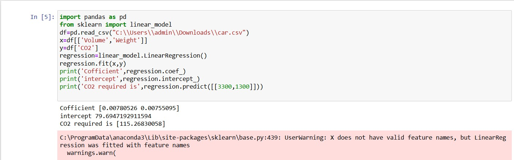

# Implementation of Multivariate Linear Regression
## Aim
To write a python program to implement multivariate linear regression and predict the output.
## Equipment’s required:
1.	Hardware – PCs
2.	Anaconda – Python 3.7 Installation / Moodle-Code Runner
## Algorithm:
### Step1
1.Import necessary modules, pandas for data manipulation and linear_model from sklearn forperforming linear regression.

## Step2
2.Use pandas.read_csv() to load the CSV file containing the dataset into a DataFrame
## Step3
3.Define the independent variables (x) as the columns "Volume" and "Weight"
## Step4
4.Define the dependent variable (y) as the "CO2" column
## Step5
5.Create a linear regression object and fit the model using the x and y data.Print the
coefficients and intercept of the trained model.
## Step6
6.Use the trained model to predict the CO2 emission for a given input (e.g., Volume=3300,
Weight=1300).Print the predicted value.

## Program:
Developed by:supriya S J

Register number:24001109

```
import pandas as pd
from sklearn import linear_model
df=pd.read_csv("C:\\Users\\admin\\Downloads\\car.csv")
x=df[['Volume','Weight']]
y=df['CO2']
regression=linear_model.LinearRegression()
regression.fit(x,y)
print('Cofficient',regression.coef_)
print('intercept',regression.intercept_)
print('CO2 required is',regression.predict([[3300,1300]]))

```
## Output:

### Insert your output



## Result
Thus the multivariate linear regression is implemented and predicted the output using python program.